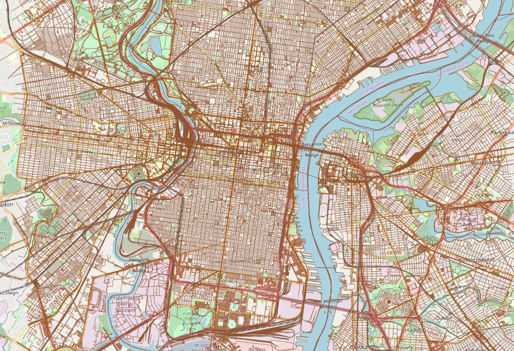
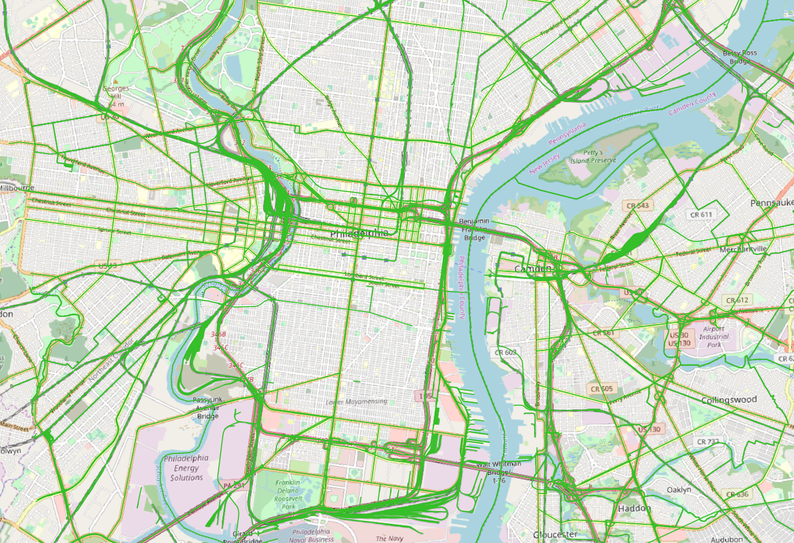
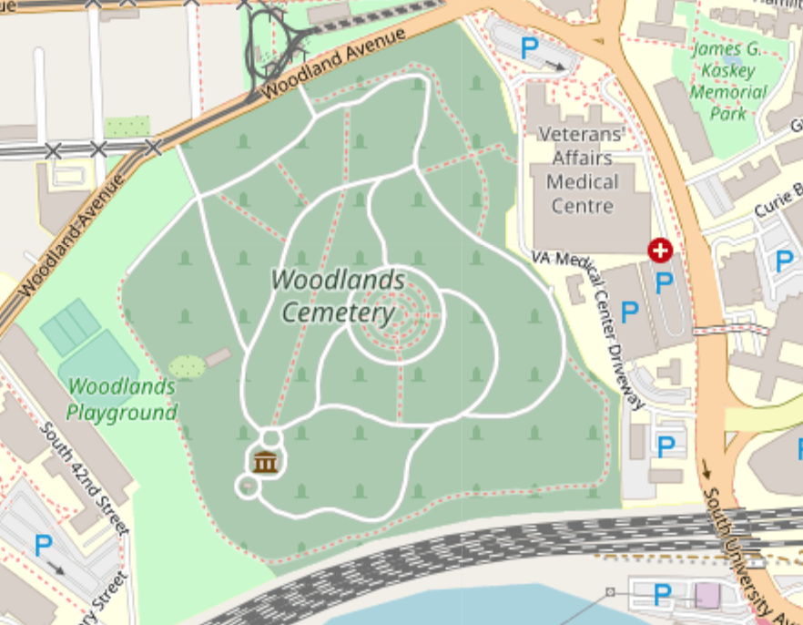
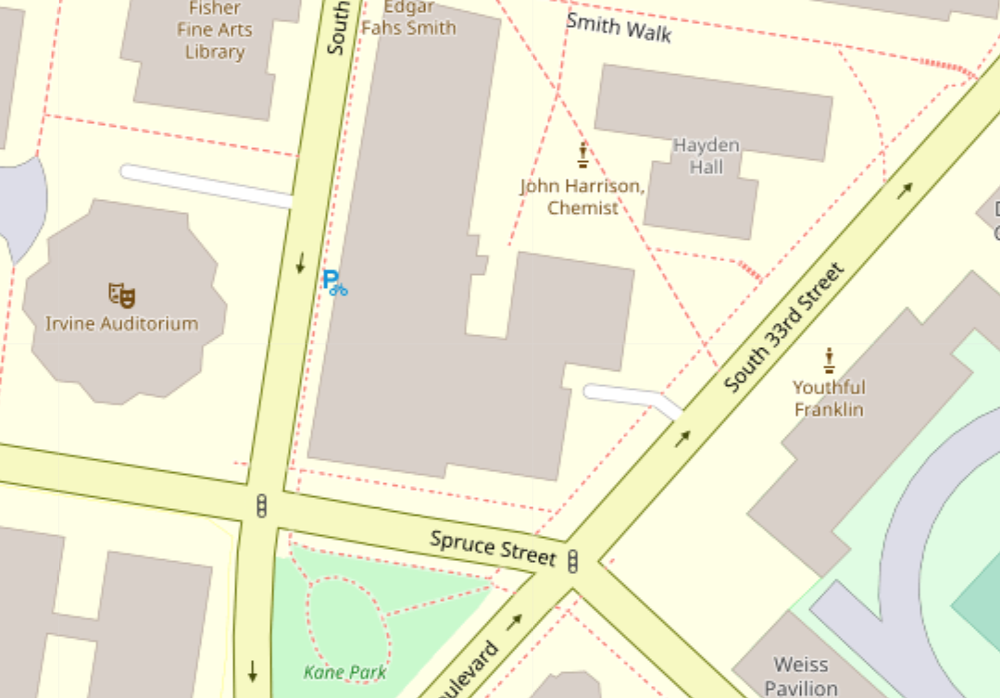

# Final Project 

# Introduction 

For my final project I wanted to use the pgrouting function of PostGIS along with OSM data to evaluate the "walkability" of routes in Philadelphia. 
Improving the walkability of cities is an interesting topic in urban planning as some U.S. cities  are seen as more walkable than others. With this project I wanted to look at how to find the most "walkable route" between two points using pgrouting and evaluate whether pgrouting is a useful tool for this anaylsis. 
Challenges: I ran into some challenges along the way with this project. OSM is open source data, so the quality of the data varies from location to location. I found that even within one place the quality of the data can vary. For this project I attempted to use two different layers that show roads/ paths of travel in different levels of detail: planet_osm_roads and planet_osm_lines. Planet_osm_roads includes almost exclusively primary, secondary, and trunk roads meaning that routes returned from this layer would be entirely on major roads that are not necessarily the most "pedestrian friendly." Planet_osm_lines has many more types of roads inlcuding primary, secondary, trunk, residential, paths, and footpaths. Planet_osm_lines has a higher potential to return pedestrian friendly paths, but because the volume of data is much larger there is more potential for inconsistencies in the data that will cause error. I was not able to get a data set error free enough from the planet_osm_lines layer to be able to use for my analysis, so for the following process I mostly used the planet_osm_roads layer.

A full list of the descriptions of OSM road types can be found here: https://wiki.openstreetmap.org/wiki/Key:highway . Road types are classified under the "highway" field. 

# Process
First I exported the OSM data on the city of Philadelphia from [Open street map](https://www.openstreetmap.org/#map=11/40.0026/-75.2385) 
To upload the data into my database I used osm2pgsql which can be found here: https://github.com/openstreetmap/osm2pgsql
Once the data has been loaded into the database the first step is to prepare the planet_osm_roads layer to be used for routing by creating topology. This step marks the verticies between road segments. These "nodes" will be used to locate the start and end points on roads while routing. 

[full SQL](finalprojectnotes.sql)

Start by adding columns to the planet_osm_roads layer for the source (start of a segment) and the target (end of a segment).
```sql
Alter table planet_OSM_roads Add column source integer;
Alter table planet_OSM_roads Add column target integer
```
Then use the create topology function. The tolerence (I used 0.00001) can be adjusted to account for small gaps inbetween the road segments. 
```sql
SELECT pgr_createTopology('planet_osm_roads', 0.00001, 'way', 'osm_id')
```
This function also creates a new table with just the nodes as ponits for the road segments. The nodes show the start and end of every road segment. the node ids are also used to locate the start and end of the routes by lining up the destination with with the node closest. [example of the nodes](nodesexample.png).  

The final step before routing is to create a "cost" column. For this initial analysis I decided to use distance as the cost, but cost could also be traveltime, or other factors. With the routing function I used, there is also the possibility of creating a reverse cost. 

Add a column for cost 
``` sql
ALTER TABLE planet_osm_roads ADD COLUMN cost double precision;
UPDATE planet_osm_roads SET cost = st_length(geography(way))
```
Next I chose two locations on the OSM map to route between. I chose the Penn museum and City Hall. For the next routing step, I chose the nodes that were the closest to their locations on the OSM map. Penn museum: 2633 City Hall: 3710
To find the shortest route in between these points I used the pgr_dijikstra function. More information about this function can be found here https://docs.pgrouting.org/2.2/en/src/dijkstra/doc/pgr_dijkstra.html

```sql 
SELECT * FROM pgr_dijkstra(
    'SELECT osm_id AS id,
         source,
         target,
		 cost
		 FROM planet_osm_roads',
    2633, 3710,
    directed := false)
```

The return from this function gives the route by the sequence, the nodes, edges, cost, and aggregated cost which in this example amounts to distance. 

To save this route I created a view called "shortest" 
then used a join to add this route to the planet_osm_roads layer as "walkingroute." 
``` sql
alter table planet_osm_roads add column walkingroute integer;
update planet_osm_roads
set walkingroute = edge
from shortest
where osm_id = edge
```
From here I moved on to visulizing the results in QGIS. I loaded the planet_osm_roads layer into Q along with the OSM standard background map using the QuickMapServices plugin. 

In QGIS I used the select by attribute function where "walkingroute" is not null to select my route on the map. Then I exported my route and named in "walkingroute" so that it would be a permanent layer. 

I used leaflet to create a visual of my resulting route. The route itself is about 2 miles. 

[Penn Musuem to City Hall lefalet](qgis2web_2019_12_11-15_55_59_222336/)

To evaluate the walkability of this route I went back into the attribute table of the planet_osm_roads map and looked at the highway field to determine what types of roads comprises this route. The route is entirely primary and secondary roads. This route is similar to the route a car would take, but for the most walking potential of this route I wanted to see if I could used the planet_osm_lines layer to get a route of comparable length with for a similar distance. 

Part 2: 
I attempted to "create topology" on planet_osm_lines just as I had with planet_osm_roads, but because of errors in the data topology couldn't be created without trying to first fix some of those errors. The errors in the data result from gaps between lines when the data was inputed by users, from lines that cross and create false intersections between points, from segments that are not designated an end point. 
QGIS has a function to "snap" together geometries that may have gaps between them from input errors. To use this function first I had to transform planet_osm_lines into a projected coordinate system. I used NAD 83 state plane Pennsylvania south and used this query to transform: 
```sql 
ALTER TABLE planet_osm_line
 ALTER COLUMN way TYPE geometry(linestring,2272) 
  USING st_transform(way,2272);
  ```
  Then I loaded the data layer into QGIS and used the "snap to layer" function with a tolerance of 20 feet. The tolerance accounts for the error distance that can exist between lines segments that it will fix. If this number is too high, it will snap together lines that aren't meant to connect such as opposite traffic lanes spilt by a boulevard. However, if this number is too low, it can't fix legitimate gaps, so it is a bit of guessing game. After this step, I also used the check validity function to check if all the geometries on this layer were valid. Those that are not valid can be fixed with the "fix geometries" function. This function should fix geometries that are invalid due to intersections, openings in the polygon, polygons within polygons etc. 
Snapping and fixing the geometries allowed me to create topology, but when trying to query routes I recieved a FAILED return. I believe this happened due to the complexity of the line paths on the planet_osm_lines layer compared to that of the planet_osm_roads layer.  
Lines:

Roads: 



There are areas on the liens map such as the woodlands cemetary where every potential path inlcluding the red doted foot paths are marked with a line:

This level of complexity introduces a lot of potential for error when users draw lines to create the osm map. And areas where the foot path is very close to the "road" marked by white lines on the image introduces potential error while using the snapping tool to correct the gaps between line segments. Paths such as the footpth and road are potentially too close not to be snapped together, but if we lower the tolerence to correct for that, we may lose some of the legitimate corrections we need to make the routing function work. Similarly, areas where a path may intersect a road without actually touching it as in the case of a bridge or tunnel could also cause this error.

In another case, areas that contain dead end roads or footpaths that do not connect to another path have the potential to disrupt the routing function: 

I believe that the dead ends have a potential to stop the routing function from continuing the route if the dead end segment is shorter in legnth than the next segment towards the destination.

# Conclusion 
To conclude on the point of error, OSM is an incredible resource for open source data on streets. However, the complexity of the planet_osm_lines layer, the fact that it is put together by a multitude of users, and that the regulation of the data varies heavily based on place and time means that there is a lot more potential for inconsistencies in the data and failure of the pgrouting function. 

Despite the issues that I ran into, I still believe that pgrouting has the potential to improve the walkability of cities. Had this application of pgrouting worked, I would have liked to look at the possiblity of using the planet_osm_lines layer with the k-shortest path function to return mulitple routes for the same start and end points. Then I would have looked at the "highway" types for each route and their distances to determine which was the shortest and most walkable from point A to point B. 
On a larger scale, k-shortest path function could be used to compare the "walkable" returns with the shortest returns for any two or more points on a map to determine if walkable routes are comparable to shortest routes. Applied to urban planning, this function could be used to suggest plans that connects more pedestrian friendly ways to each other to shorten the walking distance of pedestrian friendly routes.  
