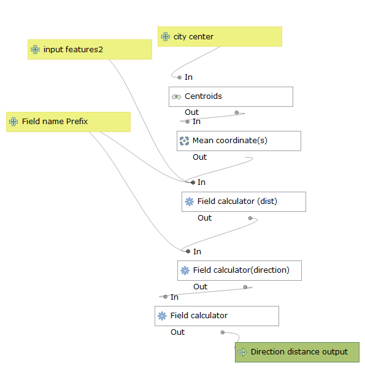

Distance from point model:

this model allows the user to find the directions and the distances of polygons on a shape file from a point either on a 
separate layer or a point created via the centroid function. This model is a sensitive to the project of the input shapefiles
User should choose projections or reproject into projections that work for calculating distance such as state plane or UTM 
projections.  

The user should consider their polygon shapefile to be featureinput2 in this model. City center should be a coordinate point 
on a separate layer, or can be created by selecting polygon(s) on the shapefile. The Model will find the centroids of the 
selected polygons then average their centers to create one coordinate point. 
Then the model will find the centroids of all the polygons in the featureinput2 layer and calculate their distances and direction from the citycenter layer.  
An added feature allows the user to create original names for output fields.
I ran the model through a case study using Milwaukee county census tracts and CBD. I obtained my data from I ran the model through a case 
study using Milwaukee county census tracts and CBD. I obtained census tract boundaries from the census's website:
https://www.census.gov/geographies/mapping-files/time-series/geo/carto-boundary-file.html 
and I obtained the tract information from American Fact Finder: https://factfinder.census.gov/faces/nav/jsf/pages/index.xhtml
The link is an example of the model used on census tracts in Milwaukee county to find the direction in degrees of census tracts from the 
city center [MapDirectionFromCityCenter](DirectionFromCityCenterMilwaukeeMetropolitan.png)  
Here you will find a link to to the model: [lab1model](Distance_from_point.model3m.model3)
Here you will find a visual of the from the case study described visualized in a scatter plot where Median Gross Rent is graphed in 
relation to direction from the city center: [scatterplot](ScatterPlotRentvsDistance.html)
Here you will find the same results visualized in a polar plot:[polarplot](PolarPlotRentvsDirection.html)
