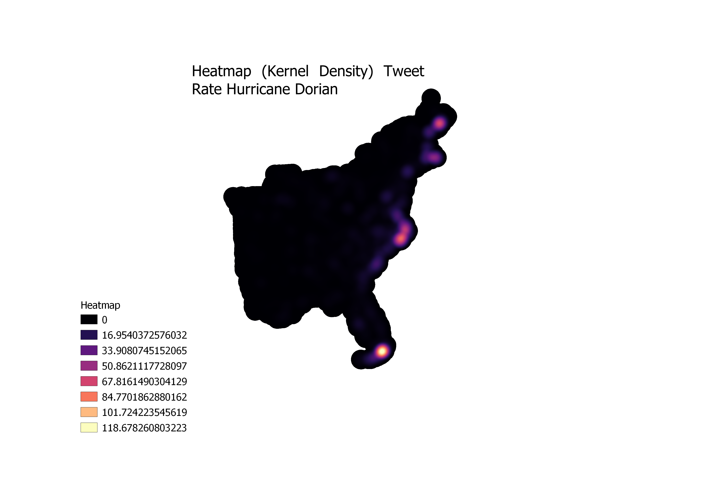
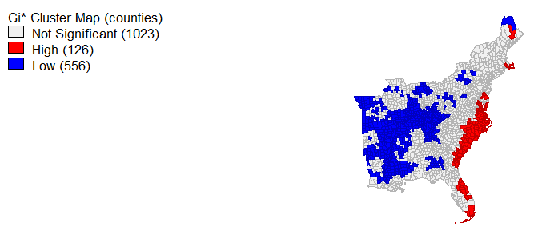
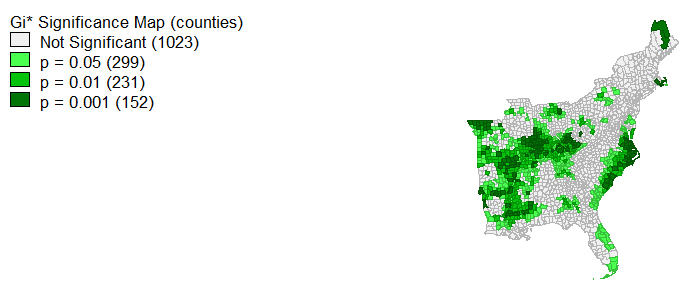

First we uploaded the two collections of tweets into a PostGIS database using te "UPLOAD RESULTS TO POSTGIS DATABASE" section from the R code above. We also used the " 
# Twitter Lab

# Introduction: 
Twitter, like other forms of social media, is a source of big data on the everyday experiences of people. With the rise of 
twitter communications geograhpers are exploring whether twitter data can be used to track major events like natural disasters and political events. In this lab, we used twitter data on Hurricane Dorian from November 2019 to explore whether the real storm or the storm of fake news from President Trump about the path of the storm generated more tweet content. The goal of this lab was to make a heat map (kernal density) in QGIS that showed areas with a high rate of tweets about Hurricane Dorian, and two maps- one that showed the hot spots and cold spots of Dorian tweets and another that identified the counties where the difference was statistically significant based one p values 0.05, 0.01, 0.001. 




# Data 
For this lab we used two collections of tweets: 
One related to Hurricane Dorian defined by keywords: fill in 
Another for the baseline tweets for November that we will use to normalize the Dorian tweets by location.
We downloaded this data via Twitter API using a developer acount. The maximum number of tweets returned for one token is 18,000 tweets. 
We also used the projected coordinate system: SA Contiguous Lambert Conformal Conic projection from https://www.spatialreference.org The SRS is 102004 . There is a PostGIS insert statement to add the coordinate system to a database.
And we used county level geographic and population data from the US census. The R code we used for this is included in the 
the next link
For this lab we used Rstudio, PostGIS, GeoDa, and QGIS

# Process 
[Full R code](twitterForLab2.r)  

First we uploaded the two collections of tweets into a PostGIS database using te "UPLOAD RESULTS TO POSTGIS DATABASE" section from the R code above. We also used the "SPATIAL ANALYSIS" section to download the county level geographic data using the Census API. 
Once everything was downloaded into the PostGIS database we used the SQl code here: 
[Full SQL code](lab10notes.sql)
to run though the next set of steps: 

First, the tweet data needs to be given point geometry so that we can do a spatial join later on with the tweets and the counties layer. They also need to be projected into a coordinate reference system: SA Contiguous Lambert Conformal Conic which had the SRS 102004 

``` sql
select addgeometrycolumn('november' ,  'geom' , 102004, 'point',2);
update november
set geom = st_transform(st_setsrid(st_makepoint(lng,lat), 4326),  102004)

select addgeometrycolumn('dorian' ,  'geom' , 102004, 'point',2);
update dorian
set geom = st_transform(st_setsrid(st_makepoint(lng,lat), 4326),  102004)
```

Transform the counties layer into Contiguous Lambert Conformal Conic and add geometry 
``` sql
update counties 
set geometry = st_transform(geometry,102004);
select addgeometrycolumn('counties' ,  'geom' , 102004, 'point',2);
select 
populate_geometry_columns('public.counties'::regclass)
```
next delete all of the counties that we don't need from the counties layer. The Hurricane was concentrated to the east coast so we don't need to anyalyze tweet data from farther west of middle America. The STATEFP is the code for the state and all counties in the same state have the same state code so all counties with these state codes will be deleted. 
``` sql
delete from counties 
where "STATEFP"
not in('54', '51', '50', '47', '45', '44', '42', '39', '37', '36', '34', '33', '29', '28', '25', '24', '23', '22', '21', '18', '17', '13', '12', '11', '10', '09', '05', '01')
```
Next add both the dorian tweets and the november tweets to the counties layer via a spatial intersect. This step allows us to give identical geoids to all the tweets that fall into the same county so that we can sum them by county in the next step. 
``` sql
alter table november add column geoid varchar(5);
update november
set geoid = _geoid
from counties
where st_intersects(counties.geometry, november.geom)

alter table dorian add column geoid varchar(5);
update dorian
set geoid = _geoid
from counties
where st_intersects(counties.geometry, dorian.geom)
```
Next count the tweets by identical geoids 
``` sql
select count(geoid) as tweetcount, geoid
from november
group by geoid
create view tweetspercounty

create table doriancounts as 
select geoid, count(dorian.geoid) as count 
from dorian 
group by dorian.geoid
```
Add columns to the counties layer where the counts of tweet per county will be stored. 
``` sql
alter table counties
add column tweetscount integer

alter table counties
add column tweetscountdorian integer
```
In order to add values to these columns they have to first be set to 0 
``` sql 
update counties 
set tweetscountdorian = 0

update counties 
set tweetscount = 0
```
add the count information to the counties layer 
``` sql
update counties 
set tweetscount = tweetcount 
from tweetspercounty
where counties._geoid = tweetspercounty.geoid

update counties 
set tweetscountdorian = count
from doriancounts
where counties._geoid = doriancounts.geoid
```
the next step is to calculate the dorian tweets normalized by the population. We do this so that all areas will be weighted equally regardless of the population. Without this step the areas with higher population would like like hotspots of tweets about the hurriane just because more people are tweeting generally in these areas. 
First add a column for the tweet rate. Then update it with the equation to normalize the data 
``` sql
alter table counties add column doriantweetrate float; 
update counties 
set doriantweetrate = ((1*1.0000)*( tweetscountdorian/"POP"))*10000
```
The last step is to normalize the dorian tweets against the baseline numbers of tweets in November. Add a column for the ndti and use the expression to normalize the tweet data. With this expression the counties will either be either -1, 0, or 1. 
``` sql
alter table counties add column ndti real; 
update counties 
set ndti = (tweetscountdorian - tweetscount)/ (tweetscountdorian + tweetscount)
Where tweetscount > 0 or tweetscountdorian > 0 
```
