This is a visualization of the steps for week 3 lab

step 1: 
Download and import 2 DEM tiles of ASTER data collected by NASA and the Japanese Space System from the Earth Data Search website. After importing the DEMs into the saga they will look like this 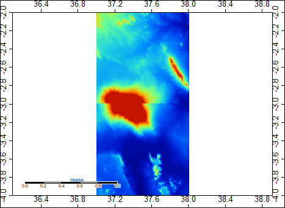

The DEMs need to be mosaiced together to create one seemless DEM. The Mosaicking tool lives under Grid> gridding> Mosaicking
Use the Nearest Neighbor parameter to execute the tool.
After the DEMS have been mosaicked they will look like this 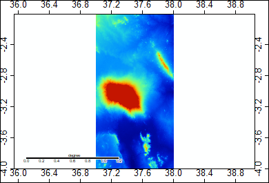

Step 2:
The DEMs are now mosaicked together, but they are in WGS84. We need to reproject into World Mercator.
to do this go to the projection tab under tools the to Proj.4 then to UTM projection (Grid). 
The >>source is now the layer that was created from the DEMs that we mosaicked together.
execute this step. Now the layers will be in World Mercator. 

Step 3: 
To create a hillshade, go to the tools and under the Terrain Analysis tab go to Lighting, visibility then to Analytical 
Hillshading. The source is the Mosaicked DEM. Keep all other parameters in default. The output will look like this 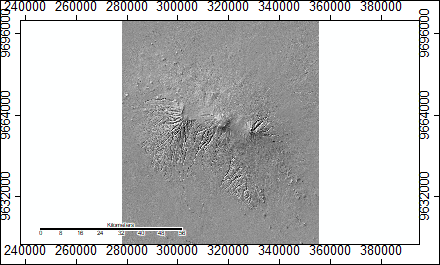

Step 4: 
 Before we can do a hyrdological analysis, we have to identify the "sinks" in the landscape and remove them. This is a two step process. To detect the sinks in the elevation model go to the Terrain analysis tab under tools then to preprocessing then 
to Sink Drainage Route Dectection. The source is the mosaic. Keep all other parameters in default. The output will look like this 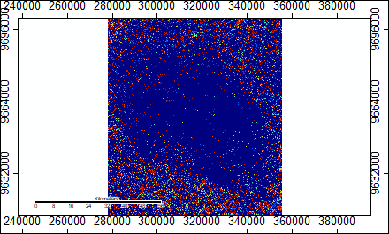

Step 5: 
Next we can remove the sinks using the previous layer we just created so that the sinks won't cause errors in analysis later on. 
To remove the sinks go to the Terrain Analysis tab under the tools then to preprocessing and to sink removal. 
Use the Mosaic as the source and the sink Route layer made in the previous step as the Sink Route. 
Create the preprocessed DEM. It will look like this 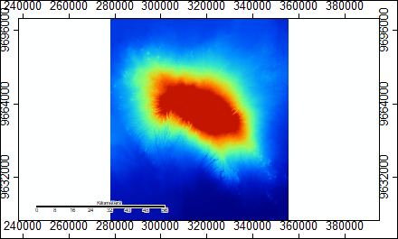

Step 6: 
Next to calcualte Flow accumulation go to terrain analysis under tools then to hydrology then to flow accumulation (top- Down)
Use the Sink filled DEM for the elevation and the sink routes made in step 4 for the Sink Routes. 
Create the Flow accumulation layer and it will look like this 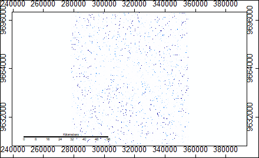

Step 7: 
The final step is to create the channel networks to determine where there are streams. 
Go to the terrain anaylsis under tools and to channels then to channel network. 
Again use the sink filled DEM for the elevation. Create the Channel network, the Channel Route, and the Channel Naetwork (shapes)
When you crteate this layer it will look like this. 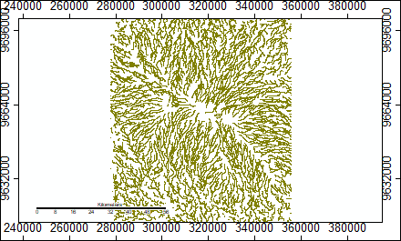

Lab4 

For lab 4, we looked at the same study area, but used a batch procress to run data to do hydrological analysis. We then used this batch 
process to run data from ASTER as we did in the first lab and SRTM data collected by NASA at 1 arc second on the same area of mnt. 
Kilimanjaro. 
The batch process for the hydrological anaylsis of ASTER data looks like this [ASTER Batch Process](mosaic_utmproj_hillshade_sinks_sinkremoval_flowaccumulation_Channelnetworks.bat)
The batch process for the same analysis with SRTM data looks like this [SRTM Batch Process](Mosaic_UTMproj_hillshade_sinks_sinkremoval_flowAcc_Channels_SRTM.bat)
Notice that the only difference between the two models are the prefix names and the file locations of the data. 

Batch processes allow the user to run multiple data sets through the same anaylsis without having to run each tool individually in SAGA.
The user can compare the outputs of two different data sets side by side. Here is a side by side comparison of the channel networks outputs for SRTM and ASTER. 

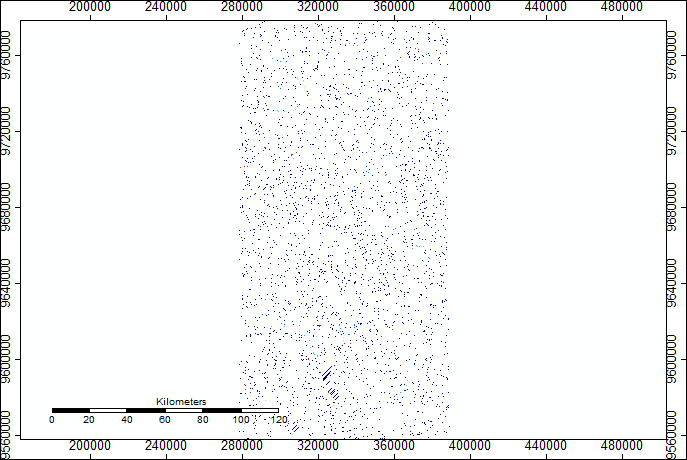
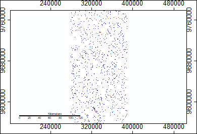

Batch processes were useful for this lab because the purpose of the lab is to identify and evaluate the prevalance of error in our 
hydrological analysis. 

The user can also run Number files for the study area through the first two steps of the batch procress so that the user will have a 
mosaicked and reprojected map of the number file. The number file has a code that allows the user to see where the data for each cell 
was drawn from in the procress of creating the elevation data.  Using this number file the user can evaluate the prevalance of 
uncertainty and what sources were used to fill those gaps. 

Once the user has the number file, they can reclassify it to show each source. an example of what it looks like for the ASTER data can seen here 
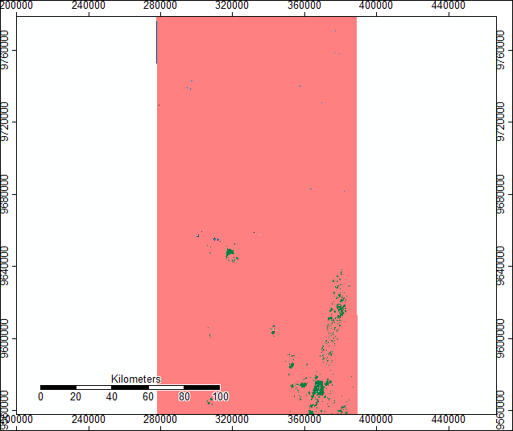
a legend to interpret that can be found here 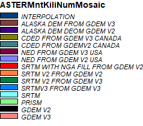

One can see using the number file and the legend that most of the data was GDEM V3, but that a large portion also shown in green is SRTM V2 from GDEM V3.

To evaluate how DEM files created from SRTM and ASTER data differ we ran the grid difference tool that can be found under the Grid the calculus tabs in SAGA.I subtracted my ASTER- STRM to see the variance in elevation data between them. The resulting map looks like this 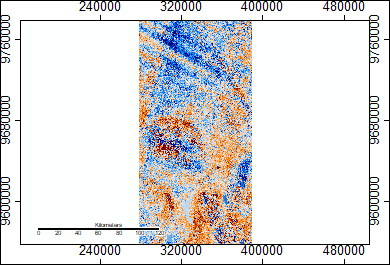 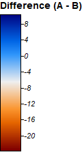 Areas in darker red and darker blue indicate higher areas of difference. 

The same tool can be used to run an anaylsis on outputs of flow accumulation from the SRTM and ASTER data. 
Here are the results of ASTER flow accummulation minus SRTM flow accummulation 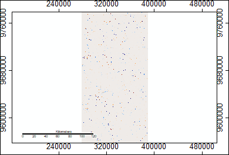
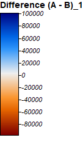 

